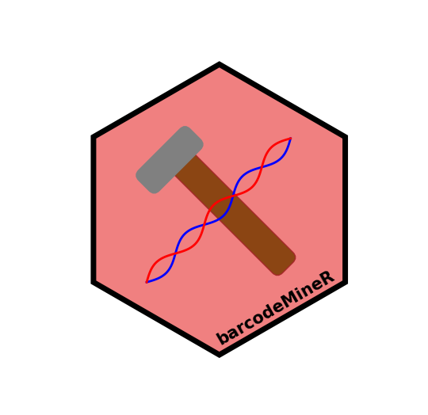

<!-- README.md is generated from README.Rmd. Please edit that file -->

```{r, include = FALSE}
knitr::opts_chunk$set(
  collapse = TRUE,
  comment = "#>",
  fig.path = "man/figures/README-",
  out.width = "100%"
)
```

**NOTE: This is a temporary GitHub repository created for testing purposes.**

# barcodeMineR 

<!-- badges: start -->
<!-- badges: end -->

The goal of barcodeMineR is to facilitate the download of DNA sequences from the NCBI and BOLD repositories, 
taking advantage of the future asynchronous framework to speed the operations while respecting the API requests
limits. It outputs a [refdb](https://github.com/fkeck/refdb?tab=readme-ov-file#refdb-a-reference-database-manager-for-r) object.

## Installation

As the package is still in development, you can install this version of barcodeMineR using the
[remotes](https://github.com/r-lib/remotes?tab=readme-ov-file#remotes) package:

``` r
install_github("MatteoCe/barcodeMineR")
```

Following the installation, the package must be 

## Example

This is a basic example which shows you how to solve a common problem:

```{r example}
library(barcodeMineR)
## basic example code
```

What is special about using `README.Rmd` instead of just `README.md`? You can include R chunks like so:

```{r cars}
summary(cars)
```

You'll still need to render `README.Rmd` regularly, to keep `README.md` up-to-date. `devtools::build_readme()` is handy for this.

You can also embed plots, for example:

```{r pressure, echo = FALSE}
plot(pressure)
```

In that case, don't forget to commit and push the resulting figure files, so they display on GitHub and CRAN.
